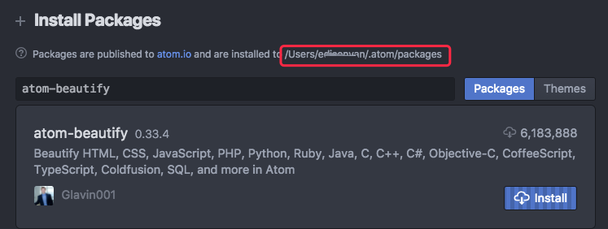
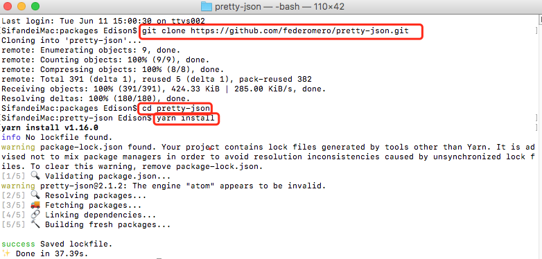

---
ebook:
  title: Atom编写markdown
  authors: EdisonVan
---

# 前言
## markdown可以用来干嘛？
- 项目需求分析
- 开发项目收获记载
- 技术书籍阅读笔记
- 给心爱的姑娘写信
- 社交平台写作：GitHub、微信公众号、知乎、博客园、语雀、掘金等众多平台支持markdown

## 学习markdown（记少不记多的原则）
献上我的markdown笔记（相信我看着一个就足以应付日常使用了，整理于markdown官方文档和个人实践！）

## 推荐工具
推荐使用Atom，为什么不用VsCode？因为vscode装太多插件可能导致各种快捷键冲突，所以强力推荐[Atom](https://atom.io/)专职书写markdown!

# 目录
* [章 1-Readme.md编写规范](#Readme.md编写规范)
  <!-- * [特性-待完善]() -->
* [章 2-为什么选Atom](#为什么选Atom)
  * [插件下载](#插件下载)
* [章 3-常用快捷键](#常用快捷键)

单文件中章节跳转写法如下：
```markdown
* [章 1-Readme.md编写规范](#Readme.md编写规范)
* [章 2-为什么选Atom](#为什么选Atom)
  * [插件下载](#插件下载)
* [章 3-常用快捷键](#常用快捷键)
```

<!-- # 为什么选Atom
Atom几大特点[待完善]
>  能直接和印象笔记绑定，实现随时存储你的文章
  能直接粘贴图片(待完善) -->

## Atom插件下载
### 高速下载方式1：
开启全局代理，在Atom编辑器中点击`Preference-Install-搜索插件名`进行下载

### 高速下载方式2：
在自己的Atom的packages文件夹中打开终端通过yarn命令行进行下载！
请看准自己的Atom的packages文件夹！

<!--  -->

Step1.打开[Atom插件官网](https://atom.io/packages)，找到自己需要安装的插件介绍页面，点击Versions到自己要下载的版本复制github链接 常见格式：`https://atom.io/packages/language-markdown`

<!--  -->

<!-- Tip:`open-in-browsers的地址为`https://atom.io/packages/open-in-browsers` -->
Step2.在Atom对应的packages文件夹下打开终端

<!--  -->

Step3.以下载pretty-json为例
   - `git clone pretty-json对应的git仓库地址`
   - `cd atom-Beautify`   （进入pretty-json插件所在文件夹）
   - `yarn/cnpm install`  (部署安装插件的依赖库，推荐使用yarn)

<!--  -->
Step4.最后重启Atom，插件安装完成

1.预览插件markdown-preview-enhanced（预览）[宇宙无敌最强]
功能简介：可以制作流程图和幻灯片，以及拖动图片上传，拖动的图片上传的地址是https://i.imgur.com，不放心的就要经常做好备份了。本地留一个备份,写完以后可以直接导出成html，pdf，md文件，以及生成长图，等等。

<!--  -->
* 使用该插件前，请先禁用Atom自带的markdown-preview插件（Enable点为disabled即可）
[markdown-preview-enhanced功能详细介绍](https://shd101wyy.github.io/markdown-preview-enhanced/#/zh-cn/)

2.同步滚动(markdown-scroll-sync)

<!--  -->

3.代码增强(language-markdown)：代码着色等基本功能，还提供了快捷的代码片段生成等功能 [请在settings中看快捷键]

4.图片粘贴(markdown-image-paste)一步完成一堆重复操作：截图－命名－保存－插入。 [需要配合千牛云等工具搭建图床，自行拓展]
  步骤1. 使用截图工具将图片复制到系统剪切板。
  步骤2. 在Markdown新起一行输入文件名。
  步骤3. Ctrl + V 会自动把图片保存到Markdown文件相同目录下(因此要求Markdown文件应该先保存)，并命名为刚输入的文件名，同时在刚才输入文件名行处生成img标签。
* 传统插入图片方式
``

5.[git动图插入插件](https://www.cockos.com/licecap/)

6.Atom Beautify
格式化代码的插件
- settings
  [使用方法参考](https://blog.csdn.net/z_blackbear/article/details/81943503)
  [格式化小程序](https://blog.csdn.net/a309785147/article/details/79001166)

7.markdown-assistant [待完善]
  >要配合uploader使用
 [markdown快捷图床搭建](https://segmentfault.com/a/1190000012070676?utm_source=Weibo&amp;utm_medium=shareLink&amp;utm_campaign=socialShare)

8.markdown-writer [待完善]

9.pretty-json（让json变得更漂亮）
  使用方式：1、选中一段json，只要选择json的内容接口；2、使用快捷键 ctrl + shift + p，打开命令输入框 输入 pretty json prettify，按enter键即可看到格式化的效果；

10.markdown格式规范插件 [待查找]

11.Atom导出epub文件  [通过calibre 这个软件]
[Github参考教程](https://shd101wyy.github.io/markdown-preview-enhanced/#/zh-cn/ebook)
MyEbook Link :/usr/local/bin/ebook-convert

12.minimap
预览全部代码的一个插件，同时能方便的移动到指定的文件位置。

13.terminal-panel
用于执行命令并显示输出。打开终端面板快捷键：Ctrl + `

14.表格编辑(markdown-table-editor)
窍门：格子出来再输入中文，每次中途切换为中文输入法，有时导致Tab键无效
使用:用Tab换一格,因为使用了language-markdown插件，所以这里要用空格
用Enter换行
用ESC退出表格编辑
写法：
```
| 插件 | 功能 |
| ------ | ---- |
| markdown-table-editor     |   写表格呗   |
```
效果：
| 插件 | 功能 |
| ------ | ---- |
| markdown-table-editor     |   写表格呗   |

15.文件路径自动提示：autocomplete-paths
16.代码快速生成：Emmet
17.open-in-browser / open-in-browsers
右键左侧菜单让html在浏览器中打开，不用再去文件里双击啦~
18.javascript-snippets：
js片段代码自动补全，就像用emmet写html一样 查看示例
19.file-icons：
左侧树状图下，根据文件类型左侧显示不同图标
20.docblockr
智能代码注释，让注释更有规范
21.git-plus
在 Atom 里面执行 Git 命令，不用来回切换终端和编辑器
22.git-control
git面板

---
# Atom编辑器书写markdown注意事项
## 常用
* 自动保存：去扩展里搜索autosave,然后点Settings勾上enabled
Atom支持模糊查询，输入相关字母或者首字母即可

* 启动自动换行
勾选设置->Editor中的 Soft Wrap即可:
* 右侧白线隐藏：
way1.增大设置->Editor->Preferred Line Length的值
way2.打开样式表Atom-Stylesheet,然后在末尾添加如下几行
```bash
atom-text-editor::shadow .wrap-guide {
//隐藏右边的白线
visibility: hidden;
}
```

* 制作目录分类管理笔记
**目录.md**
```
* [前言](doc/preface.md)
* [作用域与闭包](doc/scope.md)
* [this全面解析](doc/this.md)
* [对象](doc/Object.md)
```
`doc/preface.md`表示自动在`目录.md`同级位置创建一个doc文件夹，doc文件夹中会包含`preface.md`文件！
**doc文件夹下子文件预览**

<!--  -->


<!-- # Readme.md编写规范
> https://blog.csdn.net/hachp365/article/details/58586926 -->

# Atom常用快捷键
| 快捷键                       | 功能                                                                    |
| ---------------------------- | ----------------------------------------------------------------------- |
| cmd + shift + p              | 打开命令菜单                                                            |
| cmd + t                      | 模糊搜索工作目录下的文件                                                |
| cmt + b                      | 搜索已经打开的文件                                                      |
| ctrl + 0                     | 焦点移动到文件目录                                                      |
| cmd + \                      | 隐藏左侧目录树                                                          |
| ctrl + [                     | 目录中展开结点                                                          |
| ctrl + ]                     | 目录中缩起结点                                                          |
| d / a / m                    | 对目录选中的结点进行 删除 / 添加 / 移动                                 |
| cmd + f                      | 搜索 当前文件                                                           |
| cmd + shift + f              | 搜索 目录                                                               |
| cmd + shift + r              | 搜索 tag 前提是安装ctags (brew install ctags)且生成tags (ctags -R src/) |
| alt + cmd + [                | 收起 所在代码块                                                         |
| alt + cmd + ]                | 展开 所在代码块                                                         |
| alt + cmd + shift + [        | 收起 当前所有代码块                                                     |
| alt + cmd + shift + ]        | 展开 当前所有代码块                                                     |
| cmd + ,                      | settings                                                                |
| cmd + k ... 方向键（上、下） | 切分面板                                                                |
| cmd + w                      | 关闭当前工作面板                                                        |
|                             alt + cmd + 左右 |                               切换tab文件选项卡                                          |
